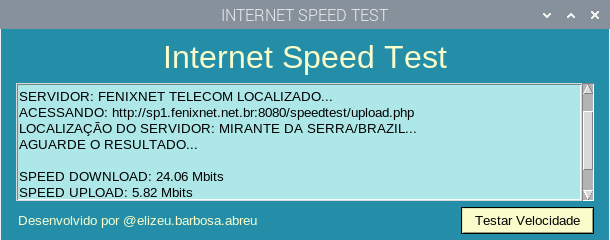

# SPEED_NET_TEST
Este software, criado totalmente em python, usa as bibliotecas pysimplegui e speedtest, respectivamente para gerar interface gráfica e testar a velocidade da internet...

# Clone este repositório: 
- git clone https://github.com/elizeubarbosaabreu/SPEED_NET_TEST

# Instale as dependencias:
Entre dentro da pasta com o comando:
- cd /SPEED_NET_TEST
- pip install -r requirements.txt
- pip3 install -r requirements.txt

# Execute o programa:
- python SpeedTestApp.py 
ou
- python3 SpeedTestApp.py 

Você também pode usar seu editor de Python preferido:
- PyCharm
- Idle Python
- VS Code
- Thonny
- Mu editor

## Obrigado por aprender e compartilhar o conhecimento!!!

